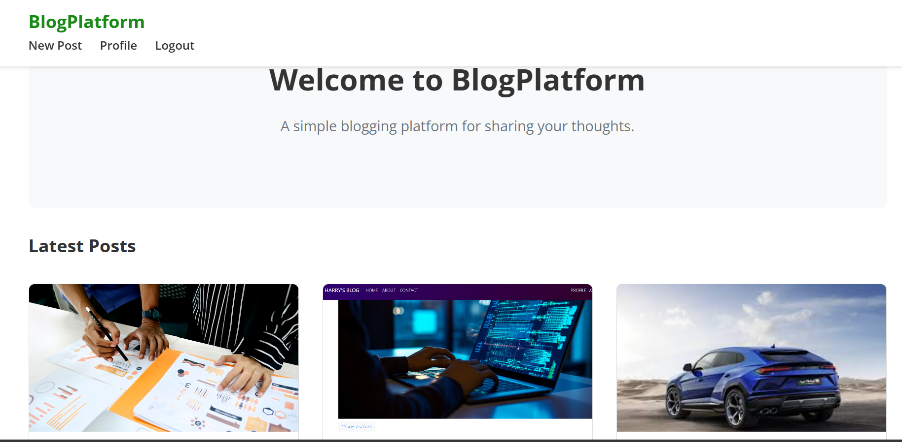
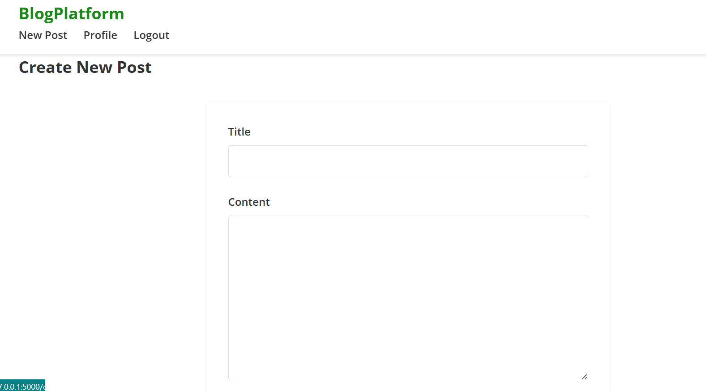

# Flask Blog App

This is a simple blog web application built with **Flask** and **SQLAlchemy**. It allows users to register, log in, create posts with optional image uploads, and view individual blog posts.

---

## 🚀 Features

- User registration and login
- Password hashing for secure storage
- Post creation with image upload
- Post listing and individual post viewing
- Session-based authentication
- Image upload validation
- SQLite database using SQLAlchemy ORM

SCREENSHOTS:

---

## 🛠 Technologies Used

- Python 3.x
- Flask
- Flask-SQLAlchemy
- Werkzeug (for password hashing and secure file handling)
- SQLite (as the database)

---

## 📁 Project Structure :

blog-platform/
├── app.py                # Flask application
├── static/
│   ├── css/
│   │   └── style.css     # Our custom styles
│   ├── js/
│   │   └── main.js       # JavaScript for interactivity
│   └── images/           # For storing uploaded images
├── templates/
│   ├── base.html         # Base template
│   ├── index.html        # Homepage
│   ├── post.html         # Single post view
│   ├── create.html       # Post creation form
│   ├── login.html        # Login page
│   └── register.html     # Registration page
├── requirements.txt      # Python dependencies
└── README.md            # Project documentation